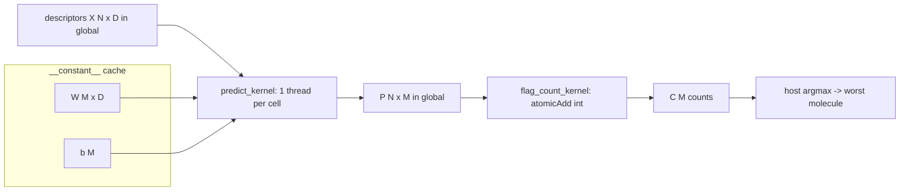

# THEORY — 1.16 ADMET / Toxicity Prediction

> The deep didactic explanation (the "why"). Written for a sharp student who
> knows C++ but is new to CUDA and new to this domain. See [README.md](README.md)
> for the quick tour and build steps.
>
> _Educational only — not for clinical use. This project is a **reduced-scope
> teaching version** (CLAUDE.md §13): the production graph neural network is
> described here but not trained; a linear multi-task model stands in for it so
> the CUDA pattern is the focus._

---

## 1. The science

A drug candidate can be a brilliant binder of its target and still fail, because
the body does things to the molecule and the molecule does things to the body.
Pharmacologists summarize this with the acronym **ADMET**:

- **A**bsorption — does it get into the bloodstream (e.g. gut permeability, Caco-2)?
- **D**istribution — where does it go (e.g. plasma-protein binding, brain
  penetration across the blood-brain barrier)?
- **M**etabolism — how is it chemically transformed (e.g. inhibition or turnover
  by cytochrome-P450 enzymes like CYP3A4/CYP2D6)?
- **E**xcretion — how fast is it cleared (e.g. renal/hepatic clearance)?
- **T**oxicity — does it harm the patient (e.g. **hERG** channel block → cardiac
  arrhythmia; **Ames** mutagenicity → cancer risk; drug-induced liver injury)?

The brutal economics: most clinical failures trace back to bad ADMET, and each
failure can cost years and hundreds of millions of dollars. So the discovery
pipeline tries to predict ADMET **computationally and early**, screening millions
of *virtual* compounds and keeping only the ones that look safe and drug-like
before any are ever synthesized.

Each ADMET property is a separate **assay** (a lab measurement). A model that
predicts many assays at once is **multi-task**: it shares one molecular
representation across many prediction heads. The Tox21 challenge, for instance,
defines **12 toxicity endpoints** — which is why this project uses M = 12.

**What this project models.** Given a batch of candidate molecules and a set of
trained endpoint models, predict, for every molecule and every endpoint, the
probability that the molecule is "positive" (toxic / fails that assay), then
triage: which endpoints flag the most molecules, and which single molecule is the
worst overall. That triage is exactly what a medicinal chemist reads off an ADMET
screen.

---

## 2. The math

Each molecule *i* is represented by a fixed-length real **descriptor** vector

$$ \mathbf{x}_i = (x_{i,0}, x_{i,1}, \dots, x_{i,D-1}) \in \mathbb{R}^D . $$

In production these are RDKit physicochemical descriptors or learned D-MPNN
features (§7); here `D = 64` synthetic features.

Each toxicity endpoint *t* is a trained **logistic-regression** model: a weight
vector $\mathbf{w}_t \in \mathbb{R}^D$ and a scalar bias $b_t$. The model's
**logit** (log-odds) for molecule *i* is the affine score

$$ z_{i,t} \;=\; b_t \;+\; \sum_{d=0}^{D-1} w_{t,d}\, x_{i,d} \;=\; b_t + \mathbf{w}_t \!\cdot\! \mathbf{x}_i . $$

The predicted **probability** is the logit squashed by the logistic **sigmoid**

$$ p_{i,t} \;=\; \sigma(z_{i,t}) \;=\; \frac{1}{1 + e^{-z_{i,t}}} \;\in\; (0,1). $$

Stacking over all molecules and endpoints gives the **prediction matrix**
$P \in (0,1)^{N \times M}$ with entries $P_{i,t} = p_{i,t}$. That matrix is the
core computation.

**Reduction to a decision.** With a decision threshold $\tau = 0.5$ (the natural
logistic boundary, where $z = 0$), define the binary **flag**

$$ f_{i,t} = \mathbb{1}[\,p_{i,t} \ge \tau\,] \in \{0,1\}. $$

From the flags we derive the deterministic outputs the program reports:

- per-endpoint flag count $\;C_t = \sum_{i} f_{i,t}\;$ (how many molecules trip *t*),
- per-molecule total $\;T_i = \sum_{t} f_{i,t}\;$ (how many endpoints molecule *i* trips),
- worst molecule $\;i^\star = \arg\max_i (T_i,\; \sum_t p_{i,t})\;$ (most flags, ties
  broken by larger summed probability, then by lower index).

**Symbols:** $N$ = #molecules (runtime), $D$ = descriptor length (= `ADMET_D` = 64),
$M$ = #endpoints (= `ADMET_M` = 12); probabilities are dimensionless in $(0,1)$;
weights/biases are dimensionless log-odds contributions.

---

## 3. The algorithm

```
load: descriptors X[N][D], models (W[M][D], b[M])
for each molecule i in 0..N-1:                 # N
  for each endpoint t in 0..M-1:               #   * M
    z = b[t]                                    #     + 1
    for d in 0..D-1: z += W[t][d]*X[i][d]       #     * D   (the dot product)
    P[i][t] = sigmoid(z)
reduce:
  for each (i,t): if P[i][t] >= 0.5: C[t]++ ; T[i]++
  i_star = argmax over i of (T[i], sum_t P[i][t])
```

**Complexity.** The prediction is $O(N \cdot M \cdot D)$ multiply-adds — the dot
products dominate. The reduction is $O(N \cdot M)$. Serially on the CPU these run
one after another; the point of the GPU is that all $N \cdot M$ dot products are
**independent** and can run **at the same time**.

- Serial (CPU): one core walks $N\,M\,D$ multiply-adds → time $\propto N M D$.
- Parallel (GPU): up to thousands of cells computed concurrently; with $P$
  parallel lanes the wall time is $\propto \lceil N M / P\rceil \cdot D$. For a
  real screening library ($N \sim 10^6$–$10^9$) that is the difference between
  hours and seconds (PATTERNS.md §7 — but see §5 on tiny inputs).

---

## 4. The GPU mapping

### 4.1 Thread-to-data map

We flatten the $N \times M$ prediction matrix into a 1-D index space of
`total = N*M` **cells** and give each cell one logical thread. A grid-stride loop
lets one modest grid cover any `total`:

```
cell = blockIdx.x * blockDim.x + threadIdx.x   # this thread's first cell
stride = blockDim.x * gridDim.x                # total threads in the grid
while cell < total:
    i = cell / M                               # which molecule
    t = cell % M                               # which endpoint
    P[cell] = sigmoid(b[t] + dot(W[t], X[i]))  # the shared admet_predict()
    cell += stride
```

Block size is **256 threads** — a multiple of the 32-lane warp, enough warps (8)
to hide memory latency, and plenty of resident blocks for occupancy on
sm_75…sm_89. The grid is `ceil(total/256)` blocks, capped at 1024 so the grid
stays small (the stride loop handles the rest).

### 4.2 Memory hierarchy — *why each array lives where it does*

```
                  reads per cell        where it lives        why
  endpoint models W[M][D], b[M]    →    __constant__ memory   read by every thread,
                                                              never written, identical
                                                              across the grid → the
                                                              constant cache BROADCASTS
                                                              one address warp-wide
  descriptors     X[i][.]          →    global memory         each molecule read by M
                                                              threads; too big for
                                                              constant memory at scale
  probabilities   P[cell]          →    global memory (out)   one double written per cell
  flag counters   C[M]             →    global memory + int   M tiny contended counters
                                        atomicAdd             (see 4.3)
```

The models are only $M \cdot D = 768$ doubles (~6 KB) — they fit comfortably in
the 64 KB constant bank, and putting them there means a warp of 32 threads
evaluating the *same* endpoint reads each weight in **one** broadcast transaction
instead of 32 separate global loads. This is the identical trick the 1.12 Tanimoto
flagship uses for its query fingerprint (PATTERNS.md §1, "constant-memory query").

### 4.3 The reduction — integer atomics for determinism

After the prediction kernel fills `P`, a second kernel thresholds each cell and
**atomically adds** its 0/1 flag to the per-endpoint counter `C[t]`. Many threads
hit the same M counters concurrently, so this is a race that needs an atomic.

Crucially we accumulate in **integers**. Floating-point addition is *not*
associative, so a parallel *float* sum would depend on the (nondeterministic)
order threads finish — different runs could differ in the last bits and might not
match the CPU. Integer adds **commute**, so `atomicAdd` on an `int` counter is
both correct under contention *and* bit-for-bit deterministic, and equals the
CPU's serial count exactly (PATTERNS.md §3). Only M = 12 counters are contended,
so atomic traffic is negligible. The worst-molecule argmax is a tiny serial scan
on the host — not worth a kernel, and the host version is the obviously-correct one.

### 4.4 The shared `__host__ __device__` core

The per-element math (`admet_dot`, `admet_sigmoid`, `admet_predict`,
`admet_flagged`) lives in **one** header, `src/admet_core.h`, behind an `HD`
macro that expands to `__host__ __device__` under nvcc and to nothing under the
host compiler. The CPU reference loops it; the kernel calls it from one thread.
Same source, same arithmetic, both targets — so verification is exact, not fuzzy
(PATTERNS.md §2).



---

## 5. Numerical considerations

- **Precision: FP64 throughout.** Descriptors, weights, logits, and probabilities
  are `double`. With $D = 64$ products of $O(1)$ magnitude, a double accumulator
  loses no significant precision, and FP64 keeps the CPU and GPU within ~1e-16.
- **No fused multiply-add in the dot product.** A GPU loves to fuse `a*b+c` into a
  single-rounding FMA, where the host compiler rounds the multiply and the add
  separately (two roundings). That alone makes results differ in the last bit. We
  write the accumulation as an explicit `acc += w*x` strictly left-to-right, the
  **same operation sequence** on both sides, so they agree. (Were we to allow FMA
  or reorder the sum, we would have to loosen the tolerance — see PATTERNS.md §4.)
- **Stable sigmoid.** The naive `1/(1+exp(-z))` overflows `exp` for very negative
  `z`. We use the two-branch form (`z≥0` vs `z<0`); both branches are
  algebraically identical and CPU/GPU pick the same branch for the same `z`, so
  no divergence in value.
- **Determinism of the reduction.** Integer flag counts (§4.3) → the same result
  every run, matching the CPU exactly. The argmax tie-break is fully specified
  (more flags, then larger summed probability, then lower index), so the
  "worst molecule" is unique and reproducible.
- **Honest timing.** On the tiny committed sample the GPU is *slower* than the CPU:
  the work ($24 \times 12 \times 64$ ≈ 18k multiply-adds) is dwarfed by kernel
  launch + PCIe copy overhead. That is expected and worth seeing — the GPU's edge
  appears only when N reaches millions. Timing is a teaching artifact, never a
  benchmark claim (CLAUDE.md §12).

---

## 6. How we verify correctness

Two independent checks, run every time in `main.cu`:

1. **CPU vs GPU probability matrix.** `admet_predict_cpu` and `predict_kernel`
   call the *same* `admet_predict()`, so we expect agreement to machine
   precision. We compute `max_abs_err(P_cpu, P_gpu)` and require it `≤ 1e-9` (the
   machine-precision tolerance class, PATTERNS.md §4). In practice it is ~`5e-16`.
2. **Integer flag counts match exactly.** The GPU's per-endpoint counts (from the
   `atomicAdd` reduction) must equal the CPU's serial counts with **zero**
   difference, and the GPU's worst-molecule index must equal the CPU's. Any
   mismatch fails the run.

Why is agreement between an *independent serial* implementation and the GPU
implementation convincing? Because the two paths share only the per-element
formula, not the control flow, memory layout, or reduction strategy — so a bug in
the indexing, the launch config, the atomics, or the host/device copies would
show up as a disagreement. Matching to machine precision across all $N \cdot M$
cells is strong evidence the GPU code is correct.

A second, stronger "does it model the science" check is built into the
**synthetic data** (PATTERNS.md §6): we *plant* a broadly-toxic molecule
(`MOL_0000`, pushed to align positively with most endpoint weight vectors) and
tune the endpoint biases so flag rates spread. A correct implementation recovers
both — `MOL_0000` tops the worst-molecule ranking (11/12 flags) and per-endpoint
counts span 5/24–16/24 — which validates the end-to-end pipeline, not just
CPU==GPU agreement. **Edge cases** handled: the ragged last block (grid-stride
guard), the all-equal-flags tie (deterministic tie-break), and a dimension
mismatch in the data file (the loader throws).

---

## 7. Where this sits in the real world

This project is a **reduced-scope teaching version**. The real ADMET stack the
catalog points to differs in every layer above the GPU-mapping idea:

- **Features, not fixed descriptors.** Production models (Chemprop, ADMET-AI) use
  a **directed message-passing neural network (D-MPNN)**: the molecular graph
  (atoms = nodes, bonds = directed edges) is passed through several rounds of
  message passing that *learn* a molecular vector, which then feeds the
  prediction heads. We replace that learned vector with a fixed synthetic
  descriptor — so we teach the screen, not the representation learning.
- **Nonlinear, shared-trunk multi-task heads.** Real heads are small MLPs on a
  shared learned trunk (so endpoints with little data borrow strength from
  data-rich ones), not independent logistic regressions. Our M independent linear
  models are the classical baseline those are measured against.
- **Uncertainty quantification.** Serious ADMET reports a *confidence*, via
  **conformal prediction** (distribution-free prediction sets with coverage
  guarantees) or **evidential** learning (the network predicts the parameters of
  a distribution). Exercise 4 in the README is a first taste.
- **The production GPU stack.** The catalog names PyTorch Geometric CUDA sparse
  ops (for the graph message passing), cuDNN for the dense/attention layers, FP16
  mixed-precision training, multi-task GPU loss aggregation, and batched RDKit
  featurization. Those are libraries doing at industrial scale what our two tiny
  kernels do by hand — and seeing the hand-written version is exactly why this
  repo exists (no black boxes, CLAUDE.md §6).
- **Validation that matters.** Real pipelines use **scaffold splits** (train/test
  molecules share no core scaffold) to avoid optimistic leakage, and calibrate
  per-assay thresholds. None of that is needed for our synthetic demo, but a real
  user must do all of it before trusting a single number.

The one thing that **does** carry over is the lesson of §4: ADMET screening is a
massive grid of independent per-(molecule, endpoint) predictions, which is exactly
the shape GPUs were built for.

---

## References

- **Chemprop** — Yang et al., "Analyzing Learned Molecular Representations for
  Property Prediction" (J. Chem. Inf. Model., 2019);
  <https://github.com/chemprop/chemprop>. The D-MPNN backbone; read it to see how a
  *learned* molecular vector replaces the fixed descriptor used here.
- **ADMET-AI** — Swanson et al. (Bioinformatics, 2024);
  <https://github.com/swansonk14/admet_ai>. A fast Chemprop-RDKit ADMET ensemble;
  study its multi-endpoint output and throughput claims.
- **DeepChem** — <https://github.com/deepchem/deepchem>. Tox21 models, featurizers,
  and (importantly) correct dataset splits.
- **pkCSM** — Pires, Blundell, Ascher (J. Med. Chem., 2015);
  <https://biosig.lab.uq.edu.au/pkcsm/>. Graph-signature ADMET prediction; study the
  featurization idea.
- **Tox21** — <https://tripod.nih.gov/tox21/>. The 12-endpoint toxicity challenge
  that motivates M = 12 here.
- **TDC ADMET benchmark group** —
  <https://tdcommons.ai/benchmark/admet_group/overview/>. Standardized ADMET tasks,
  splits, and leaderboards.
- **CUDA C++ Programming Guide**, "Constant Memory" and "Atomic Functions" —
  the primitives behind §4.2 and §4.3.
