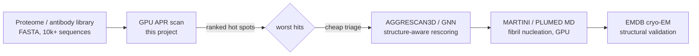

# THEORY — 1.34 Amyloid / Aggregation Propensity Prediction

> The deep didactic explanation (the "why"). Written for a sharp student who
> knows C++ but is new to CUDA and new to this domain. See [README.md](README.md)
> for the quick tour and build steps.
>
> _Educational only — not for clinical use._

---

## 1. The science

Proteins normally fold into a soluble native state. Under stress — mutation, high
concentration, an exposed sticky patch — many proteins instead **misfold and
stack into β-sheets**, growing long, insoluble, highly ordered **amyloid
fibrils**. This is not a curiosity: amyloid aggregation of Aβ and tau underlies
**Alzheimer's disease**, of α-synuclein underlies **Parkinson's**, and of
TDP-43/SOD1 underlies **ALS**. It is also the single biggest **manufacturing and
safety liability** for protein drugs — therapeutic antibodies and peptides that
aggregate are immunogenic, lose potency, and fail formulation.

Decades of experiments (and structures) converge on a key fact: aggregation is
**local and sequence-encoded**. A protein aggregates because it contains one or a
few short **aggregation-prone regions** (APRs) — typically **5–10 contiguous
residues** rich in **aliphatic (I, L, V) and aromatic (F, Y, W)** amino acids,
the residues that pack into a tight, dry β-sheet steric zipper. Charged residues
(D, E, K, R) and the conformational breakers **proline and glycine** *suppress*
aggregation. The famous experimentally-determined amyloid cores are exactly such
hexapeptides: Aβ's `KLVFFA`, islet amyloid polypeptide's (IAPP) `NFGAIL`,
tau's `VQIVYK`. (We describe these for context; the demo uses *synthetic*
sequences and does **not** reproduce them — see `data/README.md`.)

Because the signal is local and sequence-encoded, you can **predict** APRs from
sequence alone. That is what TANGO, AGGRESCAN, Zyggregator, and Waltz do: assign
each amino-acid type an **intrinsic aggregation propensity**, smooth it along the
chain, and flag the peaks. This project implements that idea transparently.

## 2. The math

**Input.** A protein is a string of residues `r_0 r_1 … r_{L-1}`, each one of 20
amino-acid types (or "other"). We have a fixed **propensity scale**
`φ : aminoacid → ℝ`, where larger `φ` means more β-aggregation-prone. In code,
`φ` is the array `AA_PROPENSITY` in `src/propensity.h`; the per-residue raw
signal is

```
p_i = φ(r_i),     i = 0 … L-1,     p_i ∈ [0, 1] for this scale.
```

**Smoothing (the core operation).** Aggregation needs a *contiguous* prone
stretch, so we take the **centered sliding-window mean** of width `W = 2h+1`:

```
            1            i+h
   s_i  =  ───   ·       Σ      p_j ,     with the window clamped to [0, L):
           n_i        j = i-h

   lo = max(0, i-h),   hi = min(L-1, i+h),   n_i = hi - lo + 1,
   s_i = (1/n_i) · Σ_{j=lo}^{hi} p_j.
```

This is a 1-D **FIR convolution** of `p` with a length-`W` box kernel,
normalized by the number of *real* residues in the window (so residues near the
N/C termini are not biased toward zero). `s_i ∈ [0, 1]`.

**Thresholding & segmentation.** Residue `i` is **aggregation-prone** if
`s_i ≥ τ` (the threshold `THRESHOLD`). A maximal run of consecutive prone
residues is an **APR**. Per protein we reduce the profile `s` to four numbers:

```
   peak_score   = max_i s_i                          (the worst hot spot's height)
   peak_pos     = argmax_i s_i                        (where it is)
   prone_count  = #{ i : s_i ≥ τ }                    (total prone residues)
   longest_apr  = max run length of consecutive prone residues
```

**Output.** For a batch of proteins, the per-protein `(peak_score, peak_pos,
prone_count, longest_apr)`, plus a **ranking** by `peak_score` (descending). The
parameters used in the demo are `W = 7`, `τ = 0.55` (justified in `main.cu`).

## 3. The algorithm

For each protein independently:

1. **Encode** residues to indices `0..20` (done once at load).
2. **Lookup**: `p_i = φ(r_i)` — `O(L)`, one table read per residue.
3. **Smooth**: compute `s_i` for all `i` — `O(L·W)` naively (each output averages
   `W` inputs). A prefix-sum could make this `O(L)`, but the box kernel is tiny
   and the `O(L·W)` form maps cleanly onto the tiling lesson, so we keep it.
4. **Reduce**: a single left-to-right pass over `s` produces all four summary
   numbers — `O(L)`. The `longest_apr` (a run length) is **inherently
   sequential**, which is why the reduction is done serially (§4, §5).

**Complexity.** For `P` proteins of length up to `L`, total work is
`O(P · L · W)`. Serial depth per protein is `O(L)` (the smoothing is fully
parallel; the reduction is the sequential tail). **Arithmetic intensity is low**
(a few adds per byte read), so the computation is **memory-bandwidth bound** —
which is precisely why the shared-memory tiling in §4 matters: it cuts global
memory traffic by ≈`W×`.

## 4. The GPU mapping

The decomposition is **one block per protein, one thread per residue** — the
batched sliding-window pattern (PATTERNS.md §1; exemplar flagship 7.10).

```
            grid.x = num_proteins                     (blockIdx.x = protein p)
   ┌─────────────────────────────────────────────────────────────────┐
   │ block p  (AGG_THREADS = 256 threads)                             │
   │                                                                  │
   │  global  flat_codes[p row] ──load+lookup──►  shared tile[ len ]  │  ← propensities
   │                              (constant c_scale broadcasts φ)      │
   │            __syncthreads()                                        │
   │                                                                  │
   │  thread t: for i = t, t+256, …                                   │
   │     s[i] = windowed_mean(tile, len, i, h)   ◄── reads ON-CHIP    │
   │            __syncthreads()                                        │
   │                                                                  │
   │  thread 0: serial reduce s[] ──► results[p] (peak/pos/count/APR) │
   └─────────────────────────────────────────────────────────────────┘
```

- **Thread-to-data mapping.** Block `p` scans protein `p`. Within the block,
  thread `t` owns residues `t, t+blockDim.x, t+2·blockDim.x, …` (a *block-stride*
  loop), so any protein up to `AGG_MAX_LEN = 1024` residues is covered regardless
  of how its length compares to the 256-thread block.
- **Launch configuration.** `grid = num_proteins`, `block = 256` (a warp
  multiple; 8 warps to hide memory latency; high occupancy on sm_75–sm_89).
  Dynamic shared memory = `max_len × sizeof(float)`.
- **Memory hierarchy and why:**
  - **Constant memory** holds the 21-entry propensity scale `c_scale`. Every
    thread reads it, it never changes during the launch → the constant cache
    **broadcasts** one value to all 32 lanes of a warp in a single transaction.
    Hand-rolling this benefit would mean manually caching the table in shared
    memory; constant memory does it for free.
  - **Shared memory** holds the protein's per-residue propensities (the *tile*).
    The window mean at residue `i` reads `W` neighbours; adjacent residues share
    `W−1` of them. The naive kernel would re-read each propensity ≈`W` times from
    **global** memory; staging the protein into shared memory once turns those
    into on-chip reads — the canonical **tiling** optimization. Because we tile
    the *whole* protein (`len ≤ AGG_MAX_LEN`), the window's halo is just in-tile
    reads with clamping; no separate halo load is needed.
  - **Registers** hold the loop indices and the running window sum.
  - **Global memory** is touched only to read the codes/lengths and write the
    smoothed profile and results — coalesced down each row.
- **No CUDA library is used.** This is deliberately a from-scratch kernel so the
  tiling and constant-memory mechanics are visible (no black box). The heavier
  *physics* regime would use libraries/frameworks (GROMACS+PLUMED, cuRAND for
  enhanced sampling, cuDNN for a GNN) — see §7.

## 5. Numerical considerations

- **Precision: FP32.** Propensities are `O(1)` and a window mean sums at most
  ~1024 of them, so single precision is ample; the demo's verification error is
  **exactly 0**.
- **CPU/GPU parity by construction (PATTERNS.md §2).** The lookup and the
  windowed mean are written **once**, as `__host__ __device__` inline functions
  in `src/propensity.h`, and called by *both* the CPU reference and the kernel.
  Same operations, **same left-to-right summation order**, same rounding → the
  smoothed profiles are bit-identical, not merely close.
- **Determinism (PATTERNS.md §3).** The per-protein reduction is done by **a
  single thread** scanning the smoothed array left to right. We avoid a parallel
  float reduction on purpose: (a) floating-point `+` is **not associative**, so a
  parallel reduction's result depends on thread-scheduling order and would not be
  bit-reproducible; and (b) `longest_apr` is a run length — an inherently
  sequential scan. The serial reduction is `O(L)`, negligible next to the
  parallel `O(L·W)` smoothing, and gives a **byte-identical stdout** every run
  (the demo diffs stdout against `expected_output.txt`).
- **Race conditions.** The two `__syncthreads()` barriers are essential: the
  whole tile must be loaded before any window read, and all `s[i]` must be
  written before thread 0 reduces them. Without them a thread could read a
  stale/uninitialized tile entry or an unwritten `s[i]`.
- **No atomics** are used anywhere — each `s[i]` and each `results[p]` has a
  single writer.

## 6. How we verify correctness

`src/reference_cpu.cpp` is an independent, obviously-correct serial scanner. The
demo runs it and the GPU kernel on the same batch and checks, in `main.cu`:

1. the **smoothed profiles** agree element-wise within `TOL = 1e-5`;
2. the **peak score** agrees within `TOL`;
3. the **integer fields** (`peak_pos`, `prone_count`, `longest_apr`) agree
   **exactly** (`==`).

**Why `1e-5` and why integers must be exact.** The CPU and GPU execute the *same*
`windowed_mean()` in the *same* order (§5), so the floats agree to a few ULPs —
`1e-5` is a tight, honest bound (PATTERNS.md §4: "same ops both sides → ~fp
epsilon"; the observed error is `0`). The reductions are over integers and
exactly-equal floats, so they must match *bit-for-bit*; an exact integer check
catches off-by-one bugs in the windowing or run-length logic that a loose float
tolerance would hide.

**Why this is convincing.** The CPU path shares no parallel logic with the GPU
path — different control flow, different memory model — yet they agree exactly.
Two independent implementations reaching the identical answer is strong evidence
the answer is right. A **second, scientific check** is built into the synthetic
data (PATTERNS.md §6): the sequences are *designed* so the correct ranking is
known (a buried β-core and a broad aliphatic stretch on top; a charged control
with **0** prone residues at the bottom), and the demo recovers exactly that
ranking — validating the *science*, not just CPU==GPU agreement.

**Edge cases handled:** termini (window clamped, divided by real count), the
padded tail of the flat layout (PAD_CODE → propensity 0, excluded by `lengths`),
near-threshold residues (the `SYNTH_MIXED` sequence deliberately straddles `τ`),
and empty proteins (`peak_score = 0`).

## 7. Where this sits in the real world

This is a faithful but **reduced-scope** version of the *sequence-scoring* family
of predictors. Production tools add:

- **Calibrated, learned scales.** TANGO uses a statistical-mechanics partition
  function over secondary-structure states; AGGRESCAN's *a3v* scale and CamSol's
  solubility scale are fit to experimental data. Our `AA_PROPENSITY` is an
  *illustrative* table — swap it for a published one (README Exercise 2).
- **Structure awareness.** AGGRESCAN3D and Solubis weight APRs by **solvent
  exposure** from a 3-D structure — a buried hydrophobic patch is harmless, an
  exposed one is not. Sequence-only scoring (this project) cannot see that.
- **Gatekeepers & context.** Real models down-weight APRs flanked by charges and
  account for pH and concentration (README Exercise 3).
- **GNNs.** Modern predictors train **graph neural networks** on sequence +
  structure; GPU inference for these is the "GNN aggregation predictor" in the
  catalog (a different CUDA pattern: batched sparse GEMM / message passing).
- **The physics regime.** To actually *watch* fibrils nucleate you run
  **coarse-grained (MARTINI) or atomistic MD** with **enhanced sampling**
  (replica-exchange, metadynamics via **PLUMED**) on the GPU — µs–ms trajectories,
  cuRAND for thermostats, contact-map tracking. That is the rigorous, expensive
  end of the spectrum; the sequence scan here is the cheap triage that decides
  *which* sequences are worth that cost. **EMDB** cryo-EM fibril maps validate the
  predicted cores structurally.

A real liability-screening pipeline runs the fast scan over a whole proteome or
an antibody library (tens of thousands of sequences) — exactly the batch this
GPU kernel is built to chew through — and escalates only the worst hits to MD.



---

## References

- **Fernandez-Escamilla, Rousseau, Schymkowitz, Serrano (2004)**, *Nat.
  Biotechnol.* — **TANGO**: the window+statistical-mechanics β-aggregation
  predictor this project abstracts.
- **Conchillo-Solé et al. (2007)**, *BMC Bioinformatics* — **AGGRESCAN**: the
  per-residue *a3v* aggregation scale; see how a real scale is built.
- **Pawar et al. (2005)**, *J. Mol. Biol.* — intrinsic aggregation-propensity
  scales (**Zyggregator**); the spirit of `propensity.h`'s table.
- **Sormanni, Aprile, Vendruscolo (2015)** — **CamSol**: solubility prediction,
  the complement of aggregation for antibody developability.
- **Zambrano et al. (2015)**, *Nucleic Acids Res.* — **AGGRESCAN3D** server
  (https://biocomp.chem.uw.edu.pl/A3D2/) — adds structure (solvent exposure).
- **Louros et al. (2020)**, *Nucleic Acids Res.* — **WALTZ-DB 2.0**
  (https://waltzdb.switchlab.org) — labeled hexapeptides to calibrate/validate.
- **Varadi et al. (2018)**, *J. Mol. Biol.* — **AmyPro** (https://amypro.net) —
  curated amyloidogenic regions; the natural real FASTA input.
- **GROMACS + PLUMED** (https://github.com/gromacs/gromacs) — the GPU MD +
  metadynamics stack for the physics regime (fibril nucleation).
- **EMDB** (https://www.ebi.ac.uk/emdb/) — cryo-EM amyloid fibril maps for
  structural validation of predicted cores.
