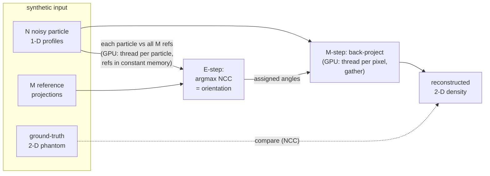

# THEORY — 2.3 Cryo-EM Single-Particle Reconstruction

> The deep didactic explanation (the "why"). Written for a sharp student who
> knows C++ but is new to CUDA and new to this domain. See
> [README.md](README.md) for the quick tour and build steps.
>
> _Educational only — not for clinical use. This is a reduced-scope 2-D teaching
> model of a 3-D research problem; see §8 for what is simplified._

---

## 1. The science

Proteins are molecular machines a few nanometres across — far too small for a
light microscope. **Cryogenic electron microscopy (cryo-EM)** images them by:

1. Flash-freezing a thin film of solution so thousands of copies of the molecule
   are trapped in a glass-like ice, each in a **random, unknown orientation**.
2. Firing a parallel electron beam through the film. Each molecule casts a 2-D
   **projection** — a shadow that is (to first order) the integral of the
   molecule's 3-D Coulomb-potential density along the beam direction.
3. Recording a noisy micrograph and cutting out individual **particles**.

The catch: each particle is a projection from an **unknown direction**, and the
electron dose must be kept tiny to avoid destroying the specimen, so the images
are **buried in noise** (SNR often below 0.1). Reconstruction must simultaneously
(a) figure out each particle's orientation and (b) combine the projections into a
single 3-D density map. This is the engine inside **RELION** and **cryoSPARC**,
and it won the 2017 Nobel Prize in Chemistry.

**The computational bottleneck** (catalog deep-dive): the orientation search.
Each of `N` particles (millions) must be compared against `M` candidate
**reference projections** (thousands) — an `O(N·M)` cross-correlation sweep that
dominates walltime. RELION-3/4 and cryoSPARC get 10–100× speedups by putting this
on the GPU. **That sweep is what this project teaches.**

### Our reduced-scope 2-D world

We strip away one dimension so the whole pipeline fits on a screen and runs in
milliseconds, while keeping the GPU pattern intact:

- the **"molecule"** is a 2-D image `ρ(x,y)` (a synthetic phantom of Gaussian blobs);
- a **"projection"** is the 1-D integral of `ρ` along parallel rays at angle `θ`
  (a column of the Radon transform / sinogram);
- the **orientation** of a particle is a single angle `θ` (instead of 3 Euler angles);
- **reconstruction** recovers the 2-D image from its 1-D projections (instead of a
  3-D volume from 2-D projections).

The two stages map one-to-one onto real cryo-EM:

```
 real cryo-EM (3-D)                  this project (2-D)
 ------------------                  ------------------
 3-D density  ρ(x,y,z)        <->    2-D image  ρ(x,y)
 2-D projection image         <->    1-D projection profile
 3 Euler angles per particle  <->    1 angle θ per particle
 projection MATCHING  (E-step)  =    projection MATCHING  (E-step)   <- GPU kernel 1
 3-D back-projection  (M-step)  =    2-D back-projection  (M-step)   <- GPU kernel 2
```

---

## 2. The math

### 2.1 Forward projection (the Radon transform)

Place the origin at the image centre `c = (IMG_SIZE-1)/2`. A view at angle `θ`
has a detector line perpendicular to the ray direction. Detector sample `s` maps
to a signed offset `t = s − c`. A point at detector offset `t`, walked a distance
`u` along the ray, sits at image coordinates

```
x(t,u,θ) = c + t·cosθ − u·sinθ
y(t,u,θ) = c + t·sinθ + u·cosθ
```

The projection value is the **line integral** over `u`:

```
p_θ(s) = ∫ ρ( x(t,u,θ), y(t,u,θ) ) du            (the Radon transform R[ρ])
```

Discretized, the integral is a sum of `PROJ_LEN` bilinearly-interpolated samples
of `ρ` along the ray. This is exactly `project_sample()` in `reference_cpu.h`, and
the same function generates the synthetic templates in `make_synthetic.py`.

### 2.2 Projection matching (the E-step)

Given a noisy particle profile `q` and the reference bank `{p_a}` (`a = 0…M−1`,
angle `θ_a = a·π/M`), the assigned orientation is the **argmax of correlation**:

```
assign(q) = argmax_a  NCC(q, p_a)
```

We use the **normalized (mean-subtracted) cross-correlation**

```
                Σ_k (q_k − q̄)(p_k − p̄)
NCC(q, p) = ───────────────────────────────────────     ∈ [−1, 1]
            sqrt( Σ_k (q_k − q̄)²  ·  Σ_k (p_k − p̄)² )
```

Subtracting the mean removes a constant brightness offset; dividing by the norms
removes a contrast scale — so a particle matches the reference of the same
**shape**, regardless of overall exposure. This is the toy analogue of RELION's
probabilistic cross-correlation under a noise model (§8). It is `ncc_score()`.

### 2.3 Back-projection (the M-step)

Once every particle has an angle, "smear" each profile back across the image
along its view direction and average. The value deposited at pixel `(x,y)` by a
particle with angle `θ` and profile `q` is `q` sampled at the detector coordinate
that `(x,y)` projects to:

```
t(x,y,θ) = c + (x−c)·cosθ + (y−c)·sinθ
recon(x,y) = (1/N) Σ_i  q_i( t(x,y, θ_{assign(i)}) )
```

This is the (unfiltered) **inverse Radon transform**. It is `backproject_pixel()`.
Summing many views of the same object reinforces the true density and averages
the noise toward zero — which is *why* cryo-EM needs thousands of particles.

---

## 3. The algorithm & complexity

```
load ρ, reference bank {p_a}, particles {q_i, true_angle_i}
E-step  (match):       for each particle i:  assign_i = argmax_a NCC(q_i, p_a)
M-step  (reconstruct): for each pixel (x,y): recon = mean_i q_i(t(x,y,θ_assign_i))
report: orientation accuracy, recon-vs-truth NCC, density digest
```

| Step | Serial complexity | Parallelism |
|---|---|---|
| E-step (match) | `O(N · M · PROJ_LEN)` | one thread per **particle** (N independent) |
| M-step (reconstruct) | `O(IMG_SIZE² · N)` | one thread per **output pixel** (IMG_SIZE² independent) |

For the sample (`N=120, M=60`) both are tiny; at cryo-EM scale (`N` in the
millions, `M` in the thousands) the E-step is the whole game — hence the GPU.

---

## 4. The GPU mapping

### Kernel 1 — `match_kernel` (projection matching, the E-step)

This is the **independent-jobs + constant-memory-query** pattern (docs/PATTERNS.md
§1; the same shape as project **1.12** Tanimoto search).

- **Thread → data:** one thread per particle, `i = blockIdx.x·blockDim.x +
  threadIdx.x`, with a **grid-stride loop** so a capped grid covers any `N`.
- **Memory hierarchy:**
  - The **reference bank lives in `__constant__` memory** (`c_refs`, 60×64×4 =
    15 KB ≪ 64 KB bank). Every thread reads the *same* reference samples, so the
    constant cache **broadcasts** one address to a whole warp in a single
    transaction — vastly cheaper than a global load per thread. This is the key
    occupancy/bandwidth win and is why projection matching is GPU-friendly.
  - Each thread copies its particle profile into a small **per-thread local
    array** once (`PROJ_LEN` floats in registers/local memory) rather than
    re-reading global memory `M` times inside the correlation.
- **No shared memory, no atomics:** each particle's result is independent, so
  there is nothing to coordinate between threads.

### Kernel 2 — `backproject_kernel` (back-projection, the M-step)

This is the **gather** pattern (docs/PATTERNS.md §1; the same shape as project
**4.01** CT back-projection).

- **Thread → data:** a 2-D grid of 16×16 blocks; thread `(px,py)` owns output
  pixel `recon[py·IMG_SIZE+px]`.
- Each thread **gathers**: it loops over all `N` particles, samples each assigned
  profile at the detector coordinate `(px,py)` maps to, and accumulates.
- **Why no atomics?** Because we made it a *gather* (pull) rather than a *scatter*
  (push): each output pixel is written by exactly one thread, so there is never a
  write conflict. Contrast project **11.09** (k-means), where scattered centroid
  updates force fixed-point atomic accumulation. Choosing gather over scatter here
  is what buys us determinism for free (see §5).

---

## 5. Numerical considerations & determinism

The demo diffs **stdout byte-for-byte**, so every printed number must be
identical every run (docs/PATTERNS.md §3). Two design choices guarantee it:

1. **Shared `__host__ __device__` core.** `project_sample`, `ncc_score`,
   `profile_lerp`, and `backproject_pixel` are defined **once** in
   `reference_cpu.h` and compiled for both the CPU reference and the GPU kernels.
   The two paths therefore run **byte-identical float arithmetic** — not "similar"
   math, the *same* math (docs/PATTERNS.md §2).
2. **Fixed reduction order.** Both the correlation sum (`k = 0…PROJ_LEN−1`) and
   the back-projection sum (`i = 0…N−1`) run in a fixed order on both sides, and
   each output is owned by one thread. There are no order-dependent atomic float
   adds anywhere.

**Tie-breaking** in the argmax uses a strict `>` so an exact score tie keeps the
**lower** angle index — identical on host and device.

**Precision.** Line integrals and trig run in `double` inside the HD core (the
projection geometry is sensitive); scores are `float` (matching real pipelines,
which are bandwidth-bound). FP32/FP64 are mixed deliberately and identically on
both sides.

### How we verify correctness

| Check | Tolerance | Why |
|---|---|---|
| GPU vs CPU orientation assignments | **exact** (0 mismatches) | integer angle indices from identical scores |
| GPU vs CPU reconstructed density | `1e-4` (observed `0.0`) | identical HD math; slack only for possible FMA-contraction differences |
| Orientation recovery vs **ground truth** | reported, not asserted | the science check: did matching recover the true angle? |
| Reconstruction vs **ground-truth image** (NCC) | reported (`0.8764`) | the science check: did we recover the molecule? |

The last two are the important honesty test: CPU==GPU only proves the two
implementations agree, not that the *answer* is right. We embed a known
ground truth (the phantom and each particle's true angle) and report how well the
pipeline recovers it. At σ≈15% noise and 3° sampling we get **70.8% exact-angle
hits, 93% within ±1 angle, 97.5% within ±2** — the misses are nearest-neighbour
confusions from noise, not failures, and the reconstruction NCC of **0.88** shows
the molecule is clearly recovered.

---

## 6. Diagram — the two-stage pipeline



---

## 7. Code reading order

1. `src/reference_cpu.h` — the data model **and** the shared HD physics
   (`project_sample`, `ncc_score`, `backproject_pixel`). Read this first; it is
   the heart of the project.
2. `src/reference_cpu.cpp` — the trusted serial loops + the dataset loader.
3. `src/kernels.cuh` → `src/kernels.cu` — the two GPU kernels and their wrappers;
   note they call the *same* HD functions, plus constant memory for the refs.
4. `src/main.cu` — orchestration: load, run CPU+GPU, verify, report.

---

## 8. Where this sits in the real world

This is a **reduced-scope teaching model**. Real single-particle cryo-EM differs in
ways worth naming:

- **3-D, not 2-D.** Orientation is 3 Euler angles (+ 2 in-plane shifts); the
  reference bank is generated by projecting a 3-D volume in thousands of
  directions, and reconstruction fills a 3-D **Fourier** volume via the
  Fourier-slice theorem (each 2-D projection's FFT is a central slice of the 3-D
  FFT). The catalog's "cuFFT for 3-D FFT reconstruction" lives here. Our
  unfiltered real-space back-projection is the didactic stand-in; a **ramp/Wiener
  filter** (as in project 4.01) sharpens it.
- **The CTF.** The microscope's contrast transfer function modulates and flips
  the sign of spatial frequencies; real pipelines **estimate and correct** it
  before matching. We omit it entirely.
- **Bayesian / MAP refinement.** RELION does not hard-assign one angle per
  particle; it computes a **posterior distribution** over orientations (the E-step
  of expectation-maximization) and back-projects a weighted sum (the M-step),
  iterating to convergence with a regularizing prior. Our single-pass hard
  argmax is the simplest possible version of that loop.
- **Heterogeneity.** Real samples contain multiple conformations;
  3-D classification and methods like **cryoDRGN** (a VAE over a latent
  conformation space) handle this. We assume one rigid structure.

Production tools to study: **RELION** (open source, CUDA), **cryoSPARC**
(non-uniform refinement), **cisTEM**, **cryoDRGN**. See the README "Prior art".

---

## 9. Exercises (extend the teaching version)

1. **Add a ramp filter** to the back-projection (FFT each profile, multiply by
   `|ω|`, inverse FFT) and watch the reconstruction NCC climb as the blur
   disappears — connect this to project 4.01.
2. **In-plane shift search:** let each particle also search over a small
   translation, not just an angle (a 2-D argmax). How does it change the kernel's
   register/occupancy budget?
3. **Soft assignment:** replace the hard argmax with a softmax over scores and
   back-project a weighted sum — the first step toward RELION's MAP refinement.
4. **Iterate:** use the current reconstruction to *re-project* fresh references,
   re-match, and repeat. Does accuracy improve? (This is the EM loop.)
5. **Break it on purpose:** make the phantom radially symmetric and observe that
   orientation recovery collapses to chance — proof that information, not compute,
   sets the limit.
