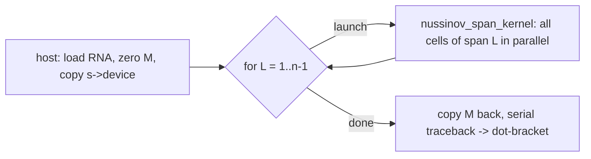

# THEORY — 3.10 RNA Secondary-Structure Prediction

> The deep didactic explanation (the "why"). Written for a sharp student who
> knows C++ but is new to CUDA and new to this domain. See [README.md](README.md)
> for the quick tour and build steps.
>
> _Educational only — not for clinical use._

---

## 1. The science

DNA stores information in a stable double helix; **RNA** is the working copy —
usually a *single* strand. A lone strand is floppy, so it folds back on itself:
stretches of complementary bases zip together into **stems** (short double
helices), and the unpaired stretches between them bulge out as **hairpin loops**,
**internal loops**, and **multi-loops**. This folded shape is the molecule's
**secondary structure**, and it largely determines what the RNA *does*: tRNA's
cloverleaf, the ribosome's rRNA scaffold, riboswitches that flip shape to turn
genes on/off, the hairpins that microRNAs are cut from.

The base-pairing chemistry is simple:

- **A–U** (two hydrogen bonds) and **G–C** (three hydrogen bonds) — the canonical
  Watson–Crick pairs (with U replacing DNA's T).
- **G–U** — the "wobble" pair, weaker but very common in real RNA.

Predicting which bases pair, given only the sequence, is the **RNA folding
problem**. Knowing the structure helps explain function, design synthetic RNAs,
and interpret mutations. (Tertiary 3-D structure is a separate, harder problem; we
predict only the 2-D pairing here.)

Two simplifying assumptions make the problem tractable and are standard for the
teaching model:

1. **No crossing pairs (no pseudoknots):** if `i–j` and `k–l` both pair, their
   intervals either nest or are disjoint, never interleave. This is what makes a
   clean dynamic program possible.
2. **A minimum hairpin loop:** a strand cannot bend back arbitrarily tightly, so a
   pair `i–j` is only allowed if at least `MIN_LOOP = 3` unpaired bases sit
   between them.

## 2. The math

Let the sequence be `s = s[0] s[1] … s[n-1]` over the alphabet `{A,C,G,U}`.
Define a pairing indicator

```
pair(i, j) = 1   if s[i],s[j] can pair (A-U / G-C / G-U)  AND  j - i > MIN_LOOP
           = 0   otherwise
```

The **Nussinov** objective is to choose a set of non-crossing pairs that
**maximises the number of base pairs**. Let `M[i][j]` be the optimal (maximum)
number of base pairs in the sub-sequence `s[i..j]` (inclusive, `i ≤ j`). The
recurrence — the heart of the whole project — is:

```
            ┌ M[i+1][j]                              (a) i unpaired
            │ M[i][j-1]                              (b) j unpaired
M[i][j] = max  M[i+1][j-1] + pair(i, j)              (c) i pairs with j
            │ max over i ≤ k < j of                  (d) bifurcation
            └     ( M[i][k] + M[k+1][j] )
```

Base cases: `M[i][i] = 0` and the empty interval scores `0` (a single base, or no
base, has no pairs). The answer for the whole molecule is `M[0][n-1]`.

- **(a),(b)** say a terminal base can simply be left unpaired.
- **(c)** closes a pair across the whole interval and recurses on the inside.
- **(d)** is the key structural move: split the interval at `k` into two
  *independent* optimally-folded halves and concatenate them. This is what lets
  multiple separate stems (a multi-loop / branched structure) coexist.

Symbols: `n` = sequence length (dimensionless); `i, j, k` = 0-based positions;
`M[i][j]` ∈ ℤ≥0 = a count of pairs; `MIN_LOOP = 3` (bases). Everything is integer.

## 3. The algorithm

**Fill order.** A cell `M[i][j]` reads only cells with a strictly smaller **span**
`L = j − i`:

- `M[i+1][j]` and `M[i][j-1]` have span `L − 1`,
- `M[i+1][j-1]` has span `L − 2`,
- the bifurcation cells `M[i][k]` and `M[k+1][j]` have spans `< L`.

So if we fill the matrix in order of **increasing span** `L = 1, 2, …, n−1`, every
read is already finalised. This is the serial reference (`nussinov_cpu`):

```
M ← all zeros (n×n)
for L = 1 … n-1:                 # span = j - i, grows outward
    for i = 0 … n-1-L:           # each interval [i, i+L]
        j = i + L
        M[i][j] = nussinov_cell(s, M, i, j, n)   # the recurrence above
```

**Complexity.** There are `Θ(n²)` cells; the bifurcation (d) scans `O(n)` split
points per cell ⇒ **`O(n³)` time**, **`O(n²)` space**. For a 10 kb RNA that is
`~10¹²` operations — minutes on a CPU, the motivation for the GPU.

**Traceback** (recover the structure) walks the optimal path: starting from
`[0, n-1]`, at each interval `[i, j]` we test cases (a)→(d) in the fixed order and
take the first that reproduces `M[i][j]`; case (c) emits a `(`…`)` bracket pair and
recurses inside; (d) splits and recurses on both halves. This is `O(n)` along the
path — serial and cheap, so we keep it on the host.

## 4. The GPU mapping

The recurrence looks serial, but the span structure exposes massive parallelism:
**all cells of one span `L` are mutually independent** (none reads another cell of
span `L`). So we fill the upper triangle as an **anti-diagonal wavefront** — one
parallel kernel launch per span.

```
   span diagonals of the upper-triangular DP matrix (j - i = L):

        j ->   0    1    2    3    4              we launch, in order:
      +----------------------------+                L=1 : cells (0,1)(1,2)(2,3)(3,4)
   i  | 0 | .   L1   L2   L3   L4  |                L=2 : cells (0,2)(1,3)(2,4)
   |  | 1 |     .    L1   L2   L3  |                L=3 : cells (0,3)(1,4)
   v  | 2 |          .    L1   L2  |                L=4 : cell  (0,4)
      | 3 |               .    L1  |
      | 4 |                    .   |              a cell on span L reads ONLY
      +----------------------------+              cells of span < L (done already)
```

**Thread-to-data map.** For span `L` there are `count = n − L` cells. We launch
`ceil(count / 128)` blocks of `128` threads; thread `t = blockIdx.x*blockDim.x +
threadIdx.x` owns cell `(i = t, j = i + L)`. The ragged last block is guarded by
`if (t >= count) return;`.

**Launch configuration.** `THREADS_PER_BLOCK = 128`: a multiple of the 32-lane
warp, small enough that the many short late spans don't waste a huge block, large
enough to give the scheduler warps to hide global-memory latency. The early spans
(`L` small) have up to `n − 1` cells and saturate the GPU; the late spans have a
handful of cells and are launch-bound (see §7).

**Memory hierarchy.** The matrix `M` lives in **global memory** (`n²` ints; too
big for shared memory in general). Each thread reads its three span-neighbours and
streams a row `M[i][·]` and a column `M[·][j]` for the bifurcation — that column
access is strided by `n`, the main bandwidth cost. The shared sequence `s` is
tiny and cached. We use **no atomics and no `__syncthreads`**: because same-span
cells never read each other, there is no intra-launch hazard; the *inter*-span
dependency is enforced for free by launching into the default stream (launch `L+1`
cannot start until launch `L` finishes).

**Why one launch per span (and what production does instead).** Issuing `n − 1`
kernels makes the dependency unmistakable — the teaching goal. A production kernel
would instead keep the whole sweep in one persistent kernel with grid-wide
synchronisation between spans, and **tile the bifurcation row/column into shared
memory** so the `O(n)` inner scan reads fast on-chip memory instead of re-reading
global memory (this is the core of CUDA RNAfold's ~14× speedup). Batched folding
of many short RNAs assigns **one CTA per sequence** and parallelises across the
batch instead of within one matrix — ideal for the LinearFold use case.

**No CUDA library is needed here.** The kernel is custom. (The catalog mentions
Thrust for energy-table init and cuFFT for unrelated spectral RNA analyses;
neither applies to base-pair-count Nussinov, so we hand-write everything — no
black boxes.)



## 5. Numerical considerations

This is the comfortable case: **everything is integer**.

- **Precision.** `M[i][j]` is a *count* of base pairs, so it is exactly
  representable in `int` (≤ `n/2`, far below 2³¹). No floating point, no rounding,
  no FP32-vs-FP64 question, no fused-multiply-add divergence between host and
  device. CPU and GPU compute **bit-identical** integers.
- **Race conditions.** None within a launch: same-span cells are independent and
  each is written by exactly one thread. The only ordering requirement —
  "span `L−1` before span `L`" — is guaranteed by serial launches into the default
  stream.
- **Determinism.** Fully deterministic. The recurrence has no reduction over an
  unordered set of floats (contrast the Monte-Carlo and k-means flagships, where
  atomic float sums reorder). Ties in the `max` are resolved identically on both
  sides because both call the same `nussinov_cell`; the traceback's fixed
  case-test order makes the *displayed* structure deterministic too. Hence stdout
  is byte-identical every run, which is what the demo diff relies on.

## 6. How we verify correctness

Two independent implementations must agree:

- **CPU reference** (`reference_cpu.cpp::nussinov_cpu`): an obviously-correct
  serial double loop over spans, with no parallelism or cleverness.
- **GPU** (`kernels.cu`): the anti-diagonal wavefront.

Both call the *same* shared `__host__ __device__` function `nussinov_cell` for the
per-cell math (docs/PATTERNS.md §2), so the only thing that differs is the
*schedule* of evaluation, not the arithmetic. `main.cu` compares the two full
`n×n` matrices and requires **exact equality** (`max_abs_diff == 0`,
`mismatches == 0`). The right tolerance here is **zero** (PATTERNS §4): integer
math run through the identical formula has no excuse to differ; any nonzero diff
is a real bug (an indexing error, a missed span, a hazard), not floating-point
noise.

A second, stronger check validates the *science*, not just CPU==GPU agreement: the
committed sample is engineered with a **known optimal fold** — the 18-nt hairpin
`GGGCGCAAAAGCGCCCAU` must yield exactly **6 base pairs** and the structure
`((((((....))))))..`. That known answer is baked into
`demo/expected_output.txt`, so a regression that broke the recurrence but kept
CPU==GPU would still be caught by the diff. Edge cases handled: sequences shorter
than `MIN_LOOP+2` (no pair possible → all-zero matrix, empty structure), and
non-ACGU input (rejected by the loader so the demo fails loudly).

## 7. Where this sits in the real world

This is a deliberately **reduced-scope teaching version** (CLAUDE.md §13). The
real tools differ in three big ways:

1. **Energy, not pair-count.** ViennaRNA's `RNAfold` and the RNAstructure package
   use the **Zuker** algorithm to minimise **free energy** with the experimentally
   measured **Turner nearest-neighbour parameters** (stacking energies, loop
   penalties, dangling ends). The DP skeleton and the wavefront are the *same*;
   only the per-cell scoring is richer. Nussinov's "+1 per pair" is the toy
   stand-in for that energy model.
2. **Probabilities, not a single structure.** The **McCaskill partition function**
   replaces `max` with a Boltzmann-weighted `sum` to compute base-pair
   *probabilities* — the same `O(n³)` DP, but it gives a confidence per pair.
   (Note: that switches the arithmetic to floating point and breaks our exact
   integer verification, an instructive trade-off — exercise 4.)
3. **Speed.** **CUDA RNAfold** runs exactly this anti-diagonal wavefront on the GPU
   with shared-memory tiling of the DP triangle (~14× on RNAs up to ~30 kb).
   **LinearFold** abandons exactness for an `O(n)` **beam-search** approximation,
   making genome-scale and high-throughput folding feasible and batching naturally
   onto GPUs. **EternaFold** learns the scoring from data instead of physics.

So the path from this project to production is: keep the wavefront, swap the
scoring (count → Turner energy), optionally swap `max` → partition-function `sum`,
and add shared-memory tiling and batching. The *parallel structure you learn here*
is the part that carries over unchanged.

---

## References

- **Nussinov, R. & Jacobson, A. B. (1980).** "Fast algorithm for predicting the
  secondary structure of single-stranded RNA." *PNAS.* The original max-pairing DP
  implemented here.
- **Zuker, M. & Stiegler, P. (1981).** Free-energy minimisation for RNA folding —
  the model production tools actually use; read it to see what energy terms
  Nussinov omits.
- **McCaskill, J. S. (1990).** The partition function for RNA base-pair
  probabilities — the `max → sum` variant.
- **Lorenz, R. et al. (2011).** "ViennaRNA Package 2.0." The reference
  implementation of energy-based folding (`RNAfold`).
- **CUDA RNAfold** (`https://www.biorxiv.org/content/10.1101/298885v1.full`) — the
  GPU anti-diagonal-wavefold this project mirrors didactically (~14× speedup).
- **Huang, L. et al. (2019). LinearFold** (`https://github.com/LinearFold/LinearFold`)
  — the `O(n)` beam-search approximation for genome-scale folding.
- **EternaFold** (`https://github.com/eternagame/EternaFold`) — ML-trained scoring;
  shows how the same DP can be parameterised from data.
