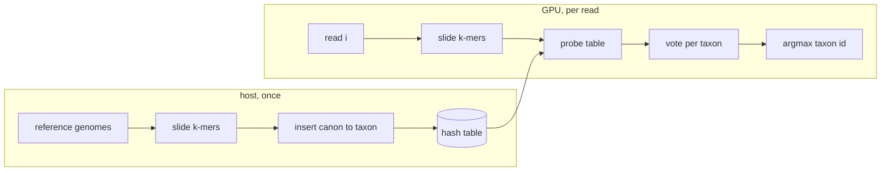

# THEORY — 3.14 Metagenomic Taxonomic Classification

> Deep didactic companion to the code. Read `README.md` first for the overview,
> then this for the *why*. Catalog ID 3.14 (Genomics, Sequencing & Bioinformatics).
>
> _Educational only — not for clinical use._

---

## The science

A **metagenome** is the pooled DNA of an entire microbial community — a gut
sample, a wastewater swab, a clinical isolate — sequenced all at once. The
sequencer does not hand you organisms; it hands you millions of short **reads**
(here ~80 bp) with no labels. The first question in almost every metagenomics
pipeline is **"who is in here, and in what proportions?"** — *taxonomic
classification* and the resulting *abundance profile*.

The classic alignment-based answer (BLAST each read against a genome database) is
far too slow at clinical throughput (millions of reads per minute). The modern
answer, popularized by **Kraken2**, is **alignment-free**: chop every reference
genome into short **k-mers** (length-*k* substrings), record which taxon each
k-mer came from in a giant hash map, and classify a read by looking up *its*
k-mers and letting them vote. No alignment, no dynamic programming — just hashing.
Real-time GPU classification of this kind matters for **point-of-care diagnostics**
(identify a pathogen at the bedside) and **pandemic surveillance** (flag a novel
organism in a sample within minutes).

This project implements that core look-up-and-vote loop on the GPU, on a tiny
**synthetic** community so a learner can watch it recover the right answer.

> Educational only. The committed data is random DNA with illustrative species
> labels; nothing here is for diagnosis or treatment.

---

## The math

**k-mers.** For a sequence *S* of length *L*, its k-mers are the *L − k + 1*
overlapping substrings of length *k*. We encode each base in **2 bits**
(A=00, C=01, G=10, T=11), so a k-mer is a `2k`-bit integer — for *k = 15*, a
30-bit value living in a `uint64_t`. As the window slides one base to the right,
the encoding updates in O(1):

```
kmer ← ((kmer << 2) | base) & MASK ,   MASK = 2^(2k) − 1
```

**Canonical k-mers (strand symmetry).** DNA is double-stranded; a read may come
from either strand, so a k-mer *x* and its **reverse complement** *x̄* are the
same biological feature. We index everything by the **canonical** form

$$\mathrm{canon}(x) = \min(x,\ \bar{x}),$$

which makes the table strand-agnostic and halves its size. The reverse complement
in 2-bit space is: complement each base (`base XOR 0b11`, because A↔T and C↔G are
the codes `0↔3` and `1↔2`) and reverse the base order.

**The reference map.** Building the database is the function

$$D : \{\text{canonical } k\text{-mers}\} \to \{\text{taxon ids}\},$$

populated by inserting every k-mer of every reference genome under its taxon id.

**Classifying a read.** For read *r* with canonical k-mers $K(r)$, count votes per
taxon and take the argmax:

$$\mathrm{votes}_t(r) = \big|\{\,\kappa \in K(r) : D(\kappa) = t\,\}\big|,
\qquad
\mathrm{label}(r) = \arg\max_t \ \mathrm{votes}_t(r),$$

with ties broken by the **lowest taxon id** for determinism, and `label = 0`
(unclassified) if no k-mer matched. The **abundance profile** is the histogram of
`label(r)` over all reads.

---

## The algorithm

**Build phase** (host, `reference_cpu.cpp::build_database`):

1. Size an open-addressing hash table to a power of two ≥ `2 ×` (#reference
   windows) so the load factor stays below ~0.5 (short probe chains).
2. For each reference genome (taxon *t*), slide a k-mer window; for each full
   window, canonicalize and **insert** `(κ → t)` by linear probing.
   - *First writer wins:* if two taxa share a k-mer, the first insertion keeps the
     slot. (The real "lowest common ancestor" rule is discussed below.)

**Classify phase** (the parallel part, shared core `kmer_core.h::classify_read`):

1. Slide a k-mer window across the read (rolling 2-bit encoding; an ambiguous base
   `N` resets the window).
2. For each full k-mer: canonicalize → **probe** the table (linear probing from
   `hash(κ) & mask`, stopping at a match or an empty slot).
3. Tally a vote for the returned taxon in a small per-read histogram.
4. Return the argmax taxon (lowest-id tie-break), or 0 if no k-mer matched.

**Complexity.** Build is `O(total reference bases)`; classification is
`O(total read bases)` hash probes, each O(1) amortized. The whole pipeline is
**linear** in input size — that linearity (vs. the quadratic cost of pairwise
alignment) is the entire reason k-mer classification scales to clinical volumes.

**Hashing.** We scramble each 64-bit k-mer with a SplitMix64-style finalizer
(xor-shift + odd-constant multiply) so that k-mers which differ by only a few low
bits (consecutive windows) scatter to well-separated slots, keeping probe chains
short. The table capacity is a power of two, so the modulo is a single `& mask`.



---

## GPU mapping

This is the **"score one query vs N items, each independent"** pattern from
`docs/PATTERNS.md` §1 (the same family as flagship `1.12` Tanimoto): classifying
read *i* is independent of every other read, so we assign **one read per thread**.

- **Thread → data.** A grid-stride loop: thread `(blockIdx.x, threadIdx.x)` starts
  at read `i = blockIdx.x*blockDim.x + threadIdx.x` and strides by the total
  thread count, so a modest grid (≤ 1024 blocks × 256 threads) covers millions of
  reads. `THREADS_PER_BLOCK = 256` is a warp multiple with enough warps to hide
  the latency of the data-dependent global look-ups.
- **Memory hierarchy.**
  - The reference table (`keys`, `taxa`) lives in **global memory** and is read by
    every thread at **data-dependent addresses** (the hash of each k-mer). This is
    deliberately *unlike* 1.12, which puts its single query in **constant memory**:
    constant memory only helps when all threads read the *same* address (broadcast).
    Here the addresses differ per thread, so the right accelerator is the **L2
    cache**, which naturally caches the hot (frequently-probed) slots.
  - The reads are stored as **one contiguous `char` buffer** with per-read offsets
    — a single H2D copy and pointer-chase-free access (Structure-of-Arrays).
  - The per-read vote histogram (`MAX_TAXA` ints) is **per-thread local/register**
    memory: private to each thread, so no synchronization is needed.
- **No shared memory, no atomics.** Each thread writes only its own `out[i]`, so
  outputs are independent and the result is **order-independent** — hence
  deterministic regardless of how the GPU schedules warps.
- **The shared core.** The per-read logic (`classify_read`) is a single
  `__host__ __device__` function in `kmer_core.h`. nvcc compiles it for the device
  (the kernel calls it once per thread) and the host compiler compiles the *same
  source* for the CPU reference. That shared core is what makes CPU and GPU agree
  *exactly* (PATTERNS.md §2).

**Where the GPU wins.** On this 40-read toy the kernel is *slower* than the CPU —
launch + copy overhead dominates a microsecond of compute (an honest teaching
caveat, PATTERNS.md §7). At real scale (millions of reads, a gigabyte-class table),
the per-read independence and the GPU's memory bandwidth give large speed-ups; that
is exactly what production tools like MetaCache-GPU exploit.

---

## Numerical considerations

- **Everything is integer.** k-mer encodings, hashes, votes, and the final taxon id
  are all integers — there is no floating point in the computation. So there is no
  rounding, no FMA divergence, and no associativity worry. CPU and GPU are
  bit-identical *by construction*, not "within a tolerance".
- **Determinism of the vote.** The argmax scans taxon ids in ascending order and
  replaces the leader only on a **strictly greater** count, so ties resolve to the
  lowest id regardless of thread order. No `atomicAdd` into a shared float, so none
  of the float-summation nondeterminism warned about in PATTERNS.md §3 applies.
- **Probe termination.** The look-up walk and the build insertion use the *same*
  hash and the *same* forward linear walk, so any inserted key is guaranteed
  findable; the probe stops at the first empty slot (key absent) or after at most
  `capacity` steps (a safety bound that never triggers because the table is
  < 50 % full).
- **`uint64_t` range.** 2-bit packing caps *k* at 31. We use *k = 15* (30 bits),
  comfortably inside the word and inside the constant `KMER_MASK`.
- **Hash collisions.** Two distinct k-mers can hash to the same *home slot*; linear
  probing resolves that (they occupy different slots). A *false k-mer match*
  (different sequences, identical 30-bit code) is impossible here because we compare
  the full `key`, not just the hash.

---

## How we verify correctness

Two independent checks, both reported by `main.cu`:

1. **GPU == CPU, exactly.** Both paths run the identical `__host__ __device__`
   `classify_read`, so the per-read taxon ids must match **bit-for-bit**. The
   verification tolerance is therefore **exactly 0** (PATTERNS.md §4, the "integer /
   same exact operations" case, like `1.12`, `3.01`, `5.01`). A single mismatch is a
   real bug, and `main.cu` prints the first offending read.
2. **Accuracy vs. ground truth.** Because the synthetic reads carry the taxon they
   were simulated from, the demo also reports `correct / classified`. On the
   committed sample it is **36/36**: every classified read recovered its source
   taxon, and the 4 random "contaminant" reads correctly landed in the
   *unclassified* bin. This validates the *science* (the method recovers the right
   community), not merely CPU/GPU agreement.

Edge cases handled: reads shorter than *k* (no k-mer, unclassified), ambiguous
bases `N` (window reset), the ragged last grid block (grid-stride guard), and the
all-zero/empty input.

---

## Where this sits in the real world

This is a faithful but deliberately **reduced-scope teaching version**. Production
classifiers differ in ways worth knowing:

- **Minimizers, not every k-mer (Kraken2).** Kraken2 stores only the *minimizer* of
  each window (the smallest k-mer in a small neighborhood), shrinking the database
  several-fold and speeding look-ups, at a small specificity cost. We index every
  k-mer for clarity. Adding minimizers is a natural exercise.
- **Lowest Common Ancestor (LCA).** When a k-mer appears in several taxa, Kraken2
  maps it to their **lowest common ancestor** on the NCBI taxonomy *tree*, so shared
  k-mers vote for a genus/family rather than misleading a species call. We use a
  flat taxon set and "first writer wins"; the real version needs the taxonomy tree
  and an LCA traversal (the catalog's "LCA traversal" algorithm).
- **FM-index alternatives (Centrifuge).** Centrifuge classifies against an FM-index
  (a compressed full-text index) with backward search instead of a k-mer hash —
  smaller memory, different trade-offs. Mash/Mash Screen use **MinHash** sketches
  for approximate Jaccard distance. All are alignment-free relatives of what we do.
- **Cuckoo / robin-hood hashing on GPU.** Real GPU implementations (MetaCache-GPU)
  use cuckoo or robin-hood tables built with **atomic compare-and-swap** for
  concurrent insertion, and a *persistent kernel* streaming reads. We build on the
  host and only *query* on the device — the query is the bottleneck and the part
  worth parallelizing first.
- **Abundance re-estimation (Bracken).** Read counts are biased by genome size and
  shared k-mers; **Bracken** runs a Bayesian re-estimation on top of Kraken2 output
  to get species-level abundances. Our raw counts are the input such a step would
  refine.

**Datasets to graduate to:** a prebuilt Kraken2 standard DB from NCBI RefSeq
genomes; CAMI benchmark metagenomes (with known truth, for measuring real
accuracy); HMP / SRA reads (see `scripts/download_data.*`).

---

### Further reading

- Wood, Lu & Langmead, *Kraken 2* (Genome Biology, 2019) — minimizer + LCA design.
- Kim et al., *Centrifuge* (Genome Research, 2016) — FM-index classification.
- Kobus et al., *MetaCache-GPU* (arXiv:2106.08150) — GPU hash-table classification.
- Ondov et al., *Mash* (Genome Biology, 2016) — MinHash distance.
- Lu et al., *Bracken* (PeerJ CS, 2017) — Bayesian abundance re-estimation.
