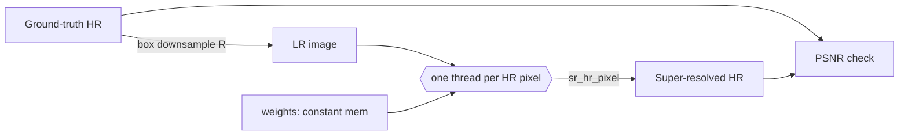

# THEORY — 4.24 CT/MRI Super-Resolution

> The deep didactic explanation (the "why"). Written for a sharp student who
> knows C++ but is new to CUDA and new to this domain. See [README.md](README.md)
> for the quick tour and build steps.
>
> _Educational only — not for clinical use._

---

## 1. The science

**The problem.** A CT or MRI scanner does not capture "the anatomy" directly — it
captures a *sampled, blurred* version of it. Resolution is limited by physics and
practicality: X-ray **dose** (finer CT resolution needs more photons → more dose),
**scan time** (finer MRI resolution needs more phase-encode lines → longer breath-
holds), slice **thickness** (MRI is often acquired as 3–5 mm axial slabs, leaving
coronal/sagittal reformats blocky), and the scanner's coil/detector geometry.

**Super-resolution (SR)** asks: given a low-resolution (LR) image, can we recover a
plausible high-resolution (HR) image? This is *ill-posed* — many HR images
downsample to the same LR image — so SR must inject a **prior** about what real
anatomy looks like. Classical priors are simple (smoothness → bilinear/bicubic
interpolation). Modern SR learns the prior from data: a convolutional network
trained on (LR, HR) pairs learns to fill in edges and textures. The medical variants
in the catalog (ESRGAN-Med, CycleGAN, diffusion SR) differ mainly in *how sharp* and
*how faithful* the reconstruction is — and in the danger of **hallucination**
(inventing structure that is not there), which is why clinical SR is validated
carefully.

**What this project teaches.** The single most reused component across learned SR is
the **sub-pixel-convolution upsampler** (Shi et al., ESPCN 2016), the block ESRGAN
stacks to reach 2×/4×. We implement that block with **fixed, synthetic weights** so
it is deterministic and legible, and we run it on a synthetic phantom so we can score
it against a known ground truth. It is a *reduced-scope teaching version*
(CLAUDE.md §13): the compute is real SR compute; the "learning" is replaced by a
hand-designed bilinear-interpolation + edge-sharpening operator.

---

## 2. The math

Let the ground-truth HR image be `H ∈ [0,1]^{Wh×Wh}` and the upscale factor `R`
(here `R = 2`). We first define the **degradation** (how LR is made):

```
    L[i,j] = (1/R²) · Σ_{a=0..R-1} Σ_{b=0..R-1} H[R·i + a, R·j + b]      (box average)
```

so `L` has size `(Wh/R)×(Wh/R)`. SR inverts this: produce `Ĥ ≈ H` from `L`.

**The sub-pixel-convolution network.** Two convolution layers over the single-channel
LR image `L`:

- **Layer 1 (feature extraction), `1 → C` channels, 3×3:**
  ```
    F_c[x,y] = ReLU( b_c + Σ_{dy=-1..1} Σ_{dx=-1..1} w^{(1)}_{c}[dx,dy] · L[x+dx, y+dy] )
  ```
  for feature channel `c = 0..C-1`. `ReLU(t) = max(0,t)` is the only nonlinearity.

- **Layer 2 (sub-pixel conv), `C → R²` channels, 3×3:**
  ```
    O_o[x,y] = b_o + Σ_{dx,dy} Σ_{c} w^{(2)}_{o,c}[dx,dy] · F_c[x+dx, y+dy]
  ```
  for output channel `o = 0..R²-1`. `O` has the LR spatial size but `R²` channels.

- **Pixel-shuffle (depth-to-space):** rearrange the `R²` channels of each LR pixel
  into an `R×R` block of the HR image. With phase `(px,py)`, `p x,py ∈ {0..R-1}`:
  ```
    Ĥ[R·x + px, R·y + py] = clamp( O_{ py·R + px }[x,y] , 0, 1 )
  ```

**The equivalence we exploit.** Instead of computing all `R²` channels and physically
reshuffling, note that HR pixel `(hx,hy)` maps to LR cell `(⌊hx/R⌋, ⌊hy/R⌋)` and phase
`(hx mod R, hy mod R)`, which selects exactly one output channel `o`. So we compute
**only that one channel** per HR pixel — the pixel-shuffle becomes an *index
computation*, not a data movement. This is the form implemented in
[`sr_core.h`](src/sr_core.h) (`sr_hr_pixel`).

**Our synthetic weights** make Layer 2 a **bilinear interpolation** of the identity
feature (`c0`, which passes `L` through) plus a **Laplacian unsharp** term (`c3`).
For `R=2` the HR sub-pixel sits `f = 1/(2R) = 0.25` of a cell off the LR-cell center,
giving bilinear weights `(1-f)(1-f), f(1-f), (1-f)f, f²` over the four nearest LR
cells; the unsharp term adds `0.75 · Laplacian(L)`. See `make_sr_weights()`.

**Quality metric — PSNR:** with max intensity `1`,
```
    PSNR(Ĥ, H) = 10 · log10( 1 / MSE ),   MSE = mean( (Ĥ − H)² ).
```
Higher dB = closer to truth. We report PSNR of the network **and** of nearest-
neighbour upscaling, so the improvement is meaningful.

---

## 3. The algorithm

```
  load H (ground-truth HR)                         # data/sample/phantom_hr.txt
  L  = box_downsample(H, R)                         # the SR input
  W  = make_sr_weights()                            # fixed synthetic weights
  for each HR pixel (hx,hy):                        # <-- the parallel loop
      (lx,ly) = (hx/R, hy/R)                        # LR cell
      (px,py) = (hx%R, hy%R); o = py*R + px         # sub-pixel phase -> channel
      # layer-2 conv over the feature map, output channel o only:
      acc = b_o
      for (dx,dy) in 3x3, for c in 0..C-1:
          acc += w2[o][c][dx,dy] * ReLU( b_c + Σ_3x3 w1[c] * L[neighbour] )
      Ĥ[hx,hy] = clamp(acc, 0, 1)
  report PSNR(Ĥ,H), PSNR(nearest,H)
```

**Complexity.** Per HR pixel: layer-2 has `3×3×C` taps, each triggering a layer-1
feature eval of `3×3` taps → `O(9·C·9) = O(81C)` multiply-adds. For an `Wh×Wh` HR
image that is `O(Wh² · C)`. Serial CPU cost is that sum run one pixel at a time; the
GPU runs all `Wh²` pixels concurrently. The nested "recompute features per pixel"
costs extra arithmetic but needs **zero inter-thread communication** — a deliberate
teaching trade-off (see §4, exercise 2 in the README materializes the feature map).

**Why recompute?** In this tiny network features are cheap, and recomputation keeps
every thread independent — the simplest correct gather. A production kernel computes
the LR feature map **once** into global/shared memory and reuses it across the `R²`
sub-pixels of each LR cell (the features are shared by all `R²` HR pixels in a block).

---

## 4. The GPU mapping

**Thread → data.** One thread owns one HR output pixel:

```
    hx = blockIdx.x * blockDim.x + threadIdx.x        // HR column
    hy = blockIdx.y * blockDim.y + threadIdx.y        // HR row
```

- **Grid/block:** a 2-D grid of **16×16 = 256-thread** blocks tiling the HR image
  (`SR_BLOCK_X × SR_BLOCK_Y`). 256 threads/block is a solid occupancy default on
  sm_75..sm_89 for a 2-D output map (same choice as flagship 4.01). The ragged edge
  is guarded by `if (hx>=hw || hy>=hh) return;`.

- **Memory hierarchy — deliberate choices:**
  - **Weights → `__constant__` memory** (`c_weights`). Every thread reads the *same*
    few hundred floats and never writes them. Constant memory has a **broadcast
    cache**: a warp reading the same address costs one fetch, not 32. Ideal for
    read-only, uniformly-accessed parameters (mirrors the query in 1.12, the filter
    in 7.10).
  - **LR image → global memory, read-only** (`const float* __restrict__`). The
    `__restrict__` + `const` let the compiler route reads through the read-only data
    cache. Neighbouring threads read overlapping 3×3 windows, so the L1/L2 cache
    serves most reads — the access pattern is naturally cache-friendly.
  - **HR output → global memory, write-only.** Consecutive threads (consecutive `hx`)
    write consecutive addresses → **coalesced** stores (one store per thread).
  - **No shared memory, no atomics, no `__syncthreads`.** Pure independent gather.

- **Occupancy & bandwidth.** The kernel is arithmetic-light and memory-light; on a
  32×32 output it is *launch-bound* (microseconds). The GPU's advantage grows with
  image size, with `C`, and especially with **3-D volumes / batches of slices**,
  where hundreds of GFLOPs of identical work run in parallel — the regime the
  catalog's "~500 GFLOPS per forward pass" describes.

**The `__host__ __device__` core.** The per-pixel math lives once in
[`sr_core.h`](src/sr_core.h), decorated `__host__ __device__` (PATTERNS.md §2). The
CPU reference loops it; the kernel calls it from one thread. Same source → same
float ops → exact agreement.



---

## 5. Numerical considerations

- **Precision.** Everything is FP32 (medical images are normalized; the network is
  float). Intermediate sums are small (≤ ~10 terms), so FP32 is ample — no
  catastrophic cancellation.
- **Determinism.** No atomics and no floating-point reduction across threads: each
  thread writes exactly one output it alone computed, in a fixed operation order. So
  the result is **bit-reproducible** run to run, and `stdout` is byte-identical
  (PATTERNS.md §3). Timing (which varies) goes to `stderr`.
- **CPU vs. GPU divergence.** Both sides call the *same* `sr_hr_pixel`, in the same
  order, so for `R=2` they agree to the last bit in practice. We still allow a
  `1e-6` tolerance to absorb any host/device **FMA-contraction** difference (the
  device may fuse `a*b+c` into one rounding step where the host does two). Measured
  `max_abs_err ≈ 1.2e-7`, well under tolerance (PATTERNS.md §4, the "same exact ops"
  case).
- **Clamping.** Outputs are clamped to `[0,1]`: SR must not emit negative or >1
  intensities. Edge pixels use **replicate (clamp) padding**, not zero-padding, so
  borders are not artificially darkened (which would bias PSNR).

---

## 6. How we verify correctness

Two independent checks:

1. **GPU == CPU (mechanism check).** `main.cu` runs both `super_resolve_cpu` and
   `super_resolve_gpu` and computes `max_abs_err`. Pass iff `≤ 1e-6`. Because both
   share `sr_core.h`, this catches any kernel bug (indexing, launch config, memory)
   rather than a math disagreement.
2. **PSNR vs. ground truth (science check).** We degrade a *known* HR image, so we
   have the true answer. We report PSNR of the SR output **and** of nearest-neighbour
   upscaling. The SR network must **beat** nearest-neighbour — on the sample it does,
   by **+1.23 dB** (23.79 vs 22.56 dB). A negative improvement would mean the operator
   is worse than doing nothing clever, which is a real failure mode we guard against
   by construction (and which the exercises invite you to explore).

Deterministic stdout (PSNR numbers, 8 sampled HR pixels, `RESULT:` line) is diffed
against `demo/expected_output.txt`, captured from a real run.

---

## 7. Where this sits in the real world

This project is the **kernel** of learned SR; production systems wrap it in far more:

| This teaching version | Production (ESRGAN / diffusion SR, MONAI, BasicSR) |
|---|---|
| 2 conv layers, `C=4`, fixed weights | 10s–100s of layers (residual-in-residual dense blocks), millions of **trained** weights |
| Hand-designed bilinear + unsharp | Weights trained on (LR,HR) pairs with **L1 + perceptual + adversarial** losses (or a diffusion objective) |
| 2-D single image | **3-D volumes**; anisotropic SR (thick-slice → isotropic) |
| Hand-rolled conv | **cuDNN** convolutions on **Tensor Cores** (FP16), pixel-shuffle as depth-to-space |
| One `.exe` | **TensorRT** INT8/FP16 engine, <5 s/volume, deployed at the scanner |
| PSNR only | PSNR **+ SSIM + radiologist reads**; explicit hallucination auditing |

The most important real-world caveat is **hallucination**: a GAN or diffusion SR can
synthesize sharp, plausible-looking structure that is *not present in the true
anatomy*. Our fixed linear-ish operator cannot hallucinate (it only interpolates and
sharpens), which is safe but limits sharpness. That trade-off — perceptual sharpness
vs. faithfulness — is the central open problem in clinical SR, and why regulators
require rigorous validation before any SR output informs a decision. **Nothing here
is validated for clinical use** (CLAUDE.md §8).

---

### Further reading

- Shi et al., *Real-Time Single Image and Video Super-Resolution Using an Efficient
  Sub-Pixel Convolutional Neural Network* (ESPCN), CVPR 2016 — the sub-pixel upsampler.
- Wang et al., *ESRGAN: Enhanced Super-Resolution GANs*, ECCV 2018 Workshops.
- MONAI, BasicSR, SynthSR (links in `data/README.md` / the catalog) — production SR.
