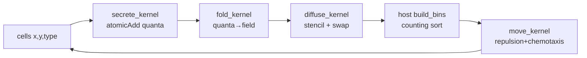

# THEORY — 6.9 Agent-Based Tissue / Immune Simulation

> The deep didactic explanation (the "why"). Written for a sharp student who
> knows C++ but is new to CUDA and new to this domain. See [README.md](README.md)
> for the quick tour and build steps.

---

## 1. The science

Real tissue is not a continuum — it is a crowd of **individual cells**, each with
its own state and behaviour. **Agent-based models (ABMs)** embrace that: every
cell is an autonomous *agent* with a position, a type, and rules for how it moves,
secretes, and interacts. This is the natural language for **tumor–immune
dynamics**, where the interesting behaviour (an immune cell finding and attacking
a tumor) is inherently individual and spatial.

We model two cell types on a 2-D tissue patch:

- **Tumor cells** sit near the centre (a nodule) and **secrete a chemokine** — a
  small signalling molecule that diffuses through the tissue.
- **Immune cells** (think cytotoxic T-cells) **chemotax**: they sense the local
  chemokine gradient and crawl *up* it, toward the source (the tumor). They also
  physically push against any cell they overlap (cells cannot interpenetrate).

Coupling these gives the classic emergent picture: a chemokine plume forms over
the tumor, and immune cells migrate inward. Production tools (**PhysiCell**) add
cell cycles, death, adhesion, multiple substrates, and 3-D geometry, and reach
10⁵–10⁶ cells; here we keep the *irreducible core* so the GPU patterns are legible.

```
    immune cells (scattered)                 chemokine field (diffused)
        o        o                                . : : .
   o        [TUMOR]     o        secrete +           : # # :
        o   ###  o                diffuse   =>      : # T # :   immune cells
      o    #####      o                              : # # :    crawl up grad(c)
         o    o    o                                  . : .        toward T
```

---

## 2. The math

### 2.1 Substrate (chemokine) field — a reaction–diffusion PDE

Let `c(x, t)` be the chemokine concentration. It diffuses (Fick's law), decays
linearly, and is produced by tumor cells:

```
∂c/∂t = D ∇²c  −  decay · c  +  S(x, t)
```

- `D` — diffusion coefficient, `decay` — first-order clearance rate.
- `S(x, t)` — the **source**: each tumor cell adds `secretion·dt` per step to the
  grid cell it occupies.

We discretize on a Cartesian grid (spacing `dx`) with the standard **5-point
Laplacian** and **forward Euler** in time:

```
c_i^{n+1} = c_i^n + dt · [ D · (c_L + c_R + c_U + c_D − 4c_i) / dx²  −  decay · c_i ]
```

with **zero-flux (Neumann)** boundaries (an out-of-domain neighbour equals the
centre, so no chemokine leaks out).

### 2.2 Cell mechanics — overdamped soft spheres

Cells are soft spheres of radius `R`. Two cells whose centres are closer than the
**contact distance** `2R` repel with a Hookean force proportional to the overlap:

```
F_ij = k_rep · (2R − r_ij) · (x_i − x_j)/r_ij     for r_ij < 2R,  else 0
```

At the cellular scale inertia is negligible (**overdamped**/Stokes regime): the
velocity is proportional to the force, not its integral. With unit drag,

```
dx_i/dt = Σ_j F_ij  +  v_chemotaxis,i
```

### 2.3 Chemotaxis

Immune cells add a velocity along the chemokine gradient:

```
v_chemotaxis,i = chemotaxis · ∇c(x_i)          (immune only; 0 for tumor)
```

with `∇c` from central differences on the grid. Positions integrate by forward
Euler: `x_i^{n+1} = x_i^n + dt · (Σ F + v_chemotaxis)`, clamped to the domain.

---

## 3. The algorithm & complexity

One timestep, three phases (the order matters and is mirrored exactly on CPU/GPU):

| Phase | What | Serial cost | Parallel work |
|---|---|---|---|
| **Secrete** | tumor cells → grid source term | O(N) | 1 thread/cell, atomic scatter |
| **Diffuse** | one explicit stencil step | O(G) (G = grid cells) | 1 thread/grid-cell |
| **Move** | repulsion + chemotaxis → new positions | O(N) *with binning* | 1 thread/cell |

The headline is the **Move** phase. Naively, testing every cell against every
other is **O(N²)** per step. **Spatial binning** fixes this:

1. Overlay a uniform grid of **bins** of side `≥ 2R` (the interaction diameter).
2. Hash each cell into its bin (a **counting sort**: count, prefix-sum, scatter).
3. A cell can only overlap cells in its **own bin or the 8 adjacent bins** (3×3
   block), because anything farther is `> 2R` away. So each cell tests only O(1)
   candidates on average → **O(N)** total.

Total per step: **O(N + G)** instead of **O(N² + G)**.

---

## 4. The GPU mapping

The whole point of this project: three *different* GPU idioms compose in one loop.
The per-element math lives once in `abm_core.h` as `__host__ __device__` functions,
so the CPU reference and the kernels run identical arithmetic.

### 4.1 Secrete — atomic scatter-reduction (like 11.09 k-means, 5.01 MC dose)

```
secrete_kernel: thread i → cell i
    if tumor: atomicAdd(&quanta[bin(cell i)], q)
```

Many tumor cells map to the same grid cell, so the adds **collide** → `atomicAdd`.
A *float* atomicAdd is order-dependent (floating-point addition is not
associative) → non-reproducible and *not* equal to the CPU's serial sum. The fix
(PATTERNS.md §3): accumulate the secreted amount as an **integer number of
quanta** (`abm_to_quanta`, `2²⁰≈1e6` quanta per unit). Integer adds commute, so
the total is **deterministic and exactly matches the CPU**. A separate
`fold_kernel` (1 thread/grid-cell) converts quanta → concentration and folds them
into the field.

### 4.2 Diffuse — nearest-neighbour stencil + ping-pong (like 6.04, 14.02)

```
diffuse_kernel: thread g → grid cell (g%gx, g/gx)
    abm_diffuse_cell reads c_old (self + 4 neighbours), writes c_new
```

Each grid cell writes only its own value and reads neighbours from the **read-only
`c_old` buffer** → no races, no atomics. We keep two field buffers and **swap**
(ping-pong) each step. Memory layout is row-major (`row*gx + col`) so consecutive
threads read consecutive addresses → coalesced loads.

### 4.3 Move — spatial binning, one thread per cell

```
move_kernel: thread i → cell i
    abm_move_cell scans the 3×3 bins around cell i (repulsion),
                  adds chemotaxis if immune, writes new_x[i]/new_y[i]
```

Reads current positions, writes a **separate** `new_x/new_y` (double-buffered), so
there are no write races even though many threads read shared neighbours.

### 4.4 The binning choice (a deliberate teaching simplification)

The bins are rebuilt on the **host** each step (`build_bins`, the counting sort)
and uploaded. Two reasons: (a) it keeps the neighbour scan order **identical** to
the CPU, so verification is exact; (b) it isolates the three GPU patterns cleanly
without a fourth (a device sort) obscuring them. The cost: a small
device→host→device round-trip per step, which makes the demo **launch-bound** on
tiny inputs. **Production / Exercise 1:** keep everything on the GPU by sorting
cell→bin keys with **Thrust `sort_by_key`** and computing `bin_start` via a
segmented scan — then the per-step host transfer vanishes and the O(N) win shows.



---

## 5. Numerical considerations

- **Precision:** positions and the field are `double`. The secretion source is
  quantized to integers (fixed-point) purely for *deterministic reduction*, then
  converted back to `double`.
- **Determinism (stdout):** the field total is an exact integer (§4.1); the
  reported distances are `double` printed at 6 decimals. Runs are byte-identical
  (verified). Timings go to **stderr** (they vary) — PATTERNS.md §3.
- **CPU vs GPU agreement:** the field total matches **exactly** (integer quanta).
  Final positions match to `~1e-9`, verified against a documented `1e-6` tolerance.
  Why not bit-exact? The GPU fuses `a*b+c` into one **FMA** instruction (one
  rounding) while the host compiler may emit a multiply then an add (two
  roundings). Over 300 steps of force/gradient sums this drifts by ~`1e-9` even in
  double precision — real, small, and worth understanding (PATTERNS.md §4; same
  effect discussed in 10.02 and 14.02).
- **Stability (CFL):** explicit diffusion needs `D·dt/dx² ≤ 1/4` in 2-D. The
  loader computes this and **refuses** to run an unstable config (fail loud, not NaN).
- **Neumann edges & clamping:** zero-flux boundaries conserve chemokine except for
  decay; positions are clamped into the domain; tiny negative concentrations from
  rounding are clamped to 0.

---

## 6. How we verify correctness

Two independent checks (`main.cu`):

1. **CPU vs GPU, exact where it can be.** `total_quanta` (the field mass in
   integer quanta) must be **bitwise equal**; final positions within `1e-6`.
2. **The science, not just parity.** The **mean immune→tumor distance** must
   *shrink* over the run (`start≈11.44 → end≈8.03` for the sample), and the
   chemokine **peak** must sit over the tumor at the domain centre (`col 15, row
   16` on the 32×32 grid). This validates that secretion → diffusion → chemotaxis
   actually produces directed migration, not just that two buggy implementations
   agree.

The CPU reference (`reference_cpu.cpp`) is the trusted baseline; it and the kernels
share `abm_core.h`, so any physics change updates both at once.

---

## 7. Where this sits in the real world

- **PhysiCell / BioFVM** — the production reference. BioFVM solves multiple
  substrates with an **implicit ADI (Thomas)** diffusion solver (unconditionally
  stable, no CFL limit) and center-based mechanics with adhesion *and* repulsion;
  PhysiCell adds Ki67/apoptosis cell cycles, secretion+uptake kinetics, and 3-D.
- **PhysiBoSS** — couples a **Boolean intracellular network** (MaBoSS) to each
  agent, so a cell's secretion/death depends on its signalling state.
- **Chaste** — off-lattice **vertex/Voronoi** mechanics, a different way to model
  cell shape and packing.
- **GPU ABMs** typically keep the whole pipeline on the device: a Thrust/CUB
  **sort-by-key** binning (Exercise 1), fused diffusion+mechanics kernels, and
  pinned memory for the rare host transfers — the pattern the catalog describes.

This project implements the irreducible hybrid (atomic scatter + stencil PDE +
spatial-binning neighbour search) so those three GPU ideas are each visible and
verifiable; it is a **teaching model**, not a validated tumor–immune simulator,
and is not for any clinical use.
